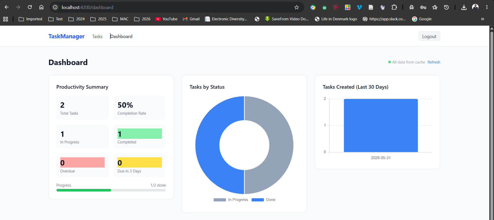

# Task Manager — Dockerized Full-Stack Application

A Dockerized Team Task Manager built with **NestJS**, **Angular**, **PostgreSQL**, **Redis**, and **Keycloak**.

## 1. Project Overview

This application allows authenticated users to manage their own tasks with full CRUD operations, view a dashboard with analytics charts, and leverages Redis for analytics caching and Keycloak for identity management.

**Stack:**
- **Frontend**: Angular 17 (standalone components, TypeScript, Tailwind CSS, Chart.js)
- **Backend**: NestJS (TypeScript, TypeORM, passport-jwt, jwks-rsa)
- **Database**: PostgreSQL 16
- **Cache**: Redis 7 (analytics cache-aside per user)
- **Auth**: Keycloak 23.0 (OIDC, auto-imported realm)

---

## 2. Architecture

See [docs/architecture.md](docs/architecture.md) for the full Mermaid diagram and detailed explanation.

**High-level:**
```
Browser → nginx:4200 → [serves Angular SPA]
Browser → nginx:4200/api/* → [proxy] → NestJS:6354 → PostgreSQL:5432
                                                    ↘ Redis:6351
Browser → Keycloak:6353 [OIDC login]
NestJS  → Keycloak:6353 [JWKS key fetch for JWT validation]
```

---

## 3. Setup Instructions

### Prerequisites
- Docker Desktop (Docker 24+ with Compose v2)
- Git

### Quick Start

```bash
# 1. Clone the repository
git clone <repo-url>
cd task-manager

# 2. Copy environment file
cp .env.example .env
# Optional: edit .env to change passwords

# 3. Start all services
docker compose up --build

# 4. Wait ~2 minutes for Keycloak to start (it takes ~60-90s)
# All 5 containers will show as "healthy" in Docker Desktop

# 5. Open the application
# Frontend:   http://localhost:4200
# Backend API (Swagger): http://localhost:6354/api/docs
# Keycloak admin: http://localhost:6353/admin (admin / adminpassword123)
```
After running up all services should be healthy and each in it's respective port....


### Stopping the Application

```bash
# Stop and remove containers (keeps data)
docker compose down

# Stop and remove containers + data volumes (full reset)
docker compose down -v
```

---

## 4. Test User Credentials

| User | Email | Password | Roles |
|---|---|---|---|
| Admin | admin@example.com | `admin123` | admin, user |
| Regular User | user@example.com | `user123` | user |

Login via the frontend at `http://localhost:4200` and  click"Login" redirects to Keycloak.

1.

2.

3.

---

## 5. Environment Variables

Copy `.env.example` to `.env`. All variables have working defaults:

| Variable | Default | Description |
|---|---|---|
| `POSTGRES_DB` | `taskmanager` | Database name |
| `POSTGRES_USER` | `taskuser` | Database user |
| `POSTGRES_PASSWORD` | `taskpassword123` | Database password |
| `REDIS_PASSWORD` | `redispassword123` | Redis auth password |
| `KEYCLOAK_ADMIN` | `admin` | Keycloak admin username |
| `KEYCLOAK_ADMIN_PASSWORD` | `adminpassword123` | Keycloak admin password |
| `KEYCLOAK_REALM` | `task-manager` | Keycloak realm name |
| `KEYCLOAK_FRONTEND_CLIENT_ID` | `task-manager-frontend` | OIDC client for Angular |
| `KEYCLOAK_BACKEND_CLIENT_ID` | `task-manager-backend` | Bearer-only client for API |

---

## 6. API Documentation

Full interactive Swagger UI available at: `http://localhost:6354/api/docs`

### Endpoints

| Method | Path | Description |
|---|---|---|
| `GET` | `/health` | Health check (public) |
| `GET` | `/api/me` | Current user profile from JWT |
| `GET` | `/api/tasks` | List user's tasks (optional `?status=todo\|in_progress\|done`) |
| `POST` | `/api/tasks` | Create a task |
| `GET` | `/api/tasks/:id` | Get a single task |
| `PUT` | `/api/tasks/:id` | Update a task |
| `DELETE` | `/api/tasks/:id` | Delete a task |
| `GET` | `/api/analytics/tasks-by-status` | Task count per status (cached) |
| `GET` | `/api/analytics/tasks-created-over-time` | Daily task creation counts (cached) |
| `GET` | `/api/analytics/summary` | Productivity summary (cached) |

All `/api/*` routes require `Authorization: Bearer <access_token>`.

### Task Schema

```json
{
  "id": "uuid",
  "title": "string (max 255)",
  "description": "string | null",
  "status": "todo | in_progress | done",
  "priority": "low | medium | high",
  "owner_id": "uuid (Keycloak subject)",
  "due_date": "ISO timestamp | null",
  "completed_at": "ISO timestamp | null",
  "created_at": "ISO timestamp",
  "updated_at": "ISO timestamp"
}
```

---

## 7. Dashboard and Visualizations

Visit `http://localhost:4200/dashboard` after logging in.

Three analytics views (all scoped to the logged-in user):

1. **Productivity Summary** — Stat cards showing total tasks, completion rate (%), in-progress count, done count, overdue tasks, and tasks due within 3 days. Includes a visual progress bar.

2. **Tasks by Status** — Doughnut chart showing distribution across `todo`, `in_progress`, and `done`. Rendered with Chart.js.

3. **Tasks Created Over Time** — Bar chart showing number of tasks created per day over the last 30 days. Useful for visualizing work intake patterns.

All analytics data comes from real PostgreSQL queries. Charts update after the Redis cache TTL (5 minutes) expires or when tasks are created/edited/deleted (which invalidates the cache immediately).

---

## 8. Redis Usage

**Purpose:** Cache-aside pattern for analytics data, scoped per user.

**How it works:**
1. When an analytics endpoint is hit, the service checks Redis for key `analytics:{userId}:{endpoint}`
2. **Cache hit**: return the cached result immediately, response includes `"cached": true`
3. **Cache miss**: query PostgreSQL, store result in Redis with 5-minute TTL, return result with `"cached": false`
4. **Cache invalidation**: whenever a task is created, updated, or deleted, all `analytics:{userId}:*` keys are deleted immediately

**Why Redis is useful here:**
- Analytics queries involve GROUP BY aggregations over potentially large task tables — expensive at scale
- Dashboard visits are read-heavy; the same data is served to multiple repeated page loads
- Per-user cache scoping ensures user A never sees user B's data

**Verifying Redis is being used:**

```bash
# Check for cached analytics keys
docker exec tm_redis redis-cli -a redispassword123 KEYS "analytics:*"

# Or connect via the host port
redis-cli -p 6351 -a redispassword123 KEYS "analytics:*"

# Check TTL on a key
docker exec tm_redis redis-cli -a redispassword123 TTL "analytics:<userId>:summary"

# Hit the analytics endpoint twice — second response has "cached": true
curl -H "Authorization: Bearer <token>" http://localhost:6354/api/analytics/summary
```
Below is a screenshot that shows all docker containers ++ redis cache  ++ scripts run for backup

**Redis failure handling:** All `RedisService` methods are wrapped in try/catch. If Redis is unavailable, the API continues to work — it simply queries PostgreSQL every time and logs a warning. The service never crashes due to Redis errors.

---

## 9. PostgreSQL Backup and Restore

### Backup

```bash
# Creates: backups/task-manager-YYYY-MM-DD_HH-MM-SS.sql
./scripts/backup-db.sh
```

### Restore

```bash
./scripts/restore-db.sh backups/task-manager-2024-01-15_10-30-00.sql
```

You will be prompted to confirm before the restore proceeds (it drops and recreates all tables).

### Manual Commands

```bash
# Manual backup
docker exec tm_postgres pg_dump -U taskuser -d taskmanager > backup.sql

# Manual restore
docker exec -i tm_postgres psql -U taskuser -d taskmanager < backup.sql
```

---

## 10. Known Limitations

1. **Keycloak uses in-memory H2 database** (`KC_DB: dev-mem`): Keycloak data does not persist across container restarts. The realm is re-imported from `keycloak/realm-export.json` on every start. For production, it is recommended to use `KC_DB: postgres` with a dedicated database.

2. **Angular environment is build-time**: Keycloak URL, realm, and client ID are compiled into the Angular bundle at build time via `environment.ts`. For multi-environment deployments, implement a runtime `config.json` approach.

3. **Redis KEYS in cache invalidation**: `redis.keys('analytics:{userId}:*')` blocks the Redis event loop. Acceptable for this scope; replace with cursor-based `SCAN` in production.

4. **No token refresh logic**: The Angular app does not proactively refresh expired Keycloak tokens. After a long session, API calls will fail with 401 until the user logs in again. A proper implementation would use `keycloak.updateToken()` in the interceptor.

5. **No automated tests**: The application is manually testable via the UI and Swagger. Unit and integration tests would be added with more time. This can be added later


---

## 11. AI Usage Summary

I have used AI at some point during development but not as the primary driver of the project.


Key decisions made personally and/with AI assistance:
- **Chart library switch**: Ran into a peer dependency conflict — `ngx-charts@20` requires Angular 21 and `ngx-charts@19` NgModules are not compatible with Angular 17 strict standalone mode. Used AI to diagnose the root cause and land on Chart.js as the replacement.
- **Keycloak issuer mismatch**: The JWT `iss` claim carried the public URL (`localhost:6353`) but the backend was validating against the internal Docker URL (`keycloak:8080`). Identified and fixed this personally by setting `frontendUrl` in `realm-export.json`.
- **Project structure**: Used AI to scaffold the standard NestJS module layout and Angular standalone component structure, then reviewed and adjusted the generated code to fit the actual requirements.

See [AI_USAGE.md](AI_USAGE.md) for detailed prompt examples and a full account of what was accepted, modified, or rejected.